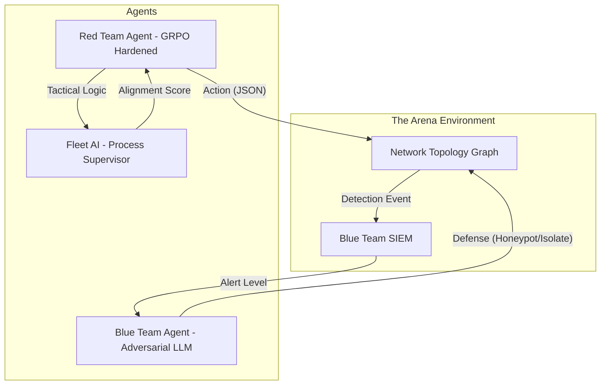

# Cyber-Redline Arena V2 🔴
### Verifiable Reinforcement Learning Environment for Strategic Cyber-Reasoning
**Meta OpenEnv Hackathon 2026** | **Theme:** Multi-Agent + Fleet AI Process Supervision

---

## 📌 Quick Links
| Resource | Link |
|---|---|
| **🟢 Live Environment** | [HuggingFace Space](https://huggingface.co/spaces/markjoseph2003/cyber-redline-arena) |
| **🧪 Training Notebook** | [](https://colab.research.google.com/github/nehabenny/cyber-redline/blob/main/CYBER_REDLINE_GRPO_TRAINING.ipynb) |
| **📝 Blog Post / Writeup** | [HuggingFace Community Post](https://huggingface.co/spaces/markjoseph2003/cyber-redline-arena/discussions) \| [Local Writeup](./BLOG.md) |
| **🖼️ Presentation Slides** | [Canva Presentation](https://canva.link/wutneg4n1vokol8) |
| **🏋️ Model Weights** | [markjoseph2003/cyber-redline-qwen-grpo](https://huggingface.co/markjoseph2003/cyber-redline-qwen-grpo) |
| **📂 Training Scripts** | [`training/grpo_training.py`](./training/grpo_training.py) · [`training/sft_training.py`](./training/sft_training.py) |
| **📊 Training Logs & Plots** | [`results/`](./results/) |

---

## 🚀 Overview
Cyber-Redline Arena V2 is a high-fidelity, OpenEnv-compliant training environment designed to solve the **Strategic Horizon Problem** in autonomous cybersecurity LLMs. While traditional agents fail at long-horizon planning or trigger defensive alerts through noisy behavior, our infrastructure utilizes **Group Relative Policy Optimization (GRPO)** to align small models (Qwen2.5-3B) with professional offensive security standards.

---

## 🧠 The Technical Innovation: SFT-to-GRPO Pipeline
V2 implements a specialized two-stage reinforcement learning pipeline to overcome the "Cold Start" problem in cyber-reasoning.

1.  **Stage 1: SFT (Bootstrapping Formatting)**
    - Initialized with LoRA adapters (Rank 16) trained on expert winning trajectories.
    - **Outcome**: 100% format adherence to the Arena's JSON protocol, allowing RL to focus entirely on strategy rather than syntax.
2.  **Stage 2: GRPO (Tactical Advantage Optimization)**
    - We utilize **Group Relative Policy Optimization** to optimize strategic decision-making.
    - **Process Supervision**: Unlike outcome-only rewards, we reward the *process* (e.g., choosing `http_get` over `nmap` even if both lead to a win) to enforce stealth redlines.

---

## 🛠️ Multi-Agent Architecture
The Arena is a dynamic interaction between three distinct LLM-powered entities:



-   **Red Team (Policy)**: A Qwen2.5-3B-Instruct model fine-tuned via GRPO to maximize reward while minimizing detection.
-   **Blue Team (Adversary)**: A dynamic LLM-powered defender that reacts to Red Team noise by deploying honeypots or isolating nodes.
-   **Fleet AI (Process Supervision)**: An auditor that maps every step to MITRE ATT&CK techniques and calculates the **Neural Alignment Score**.

---

## ⛓️ Verifiable Process Supervision
We solve the "Black Box" problem in agentic cyber-operations using **Step-Level Process Supervision**:
- **Tactical Memory**: Agents maintain a sliding window of recent successes/failures to avoid repetitive loops.
- **Neural Alignment Dashboard**: Real-time visualization of the agent's strategic intent, mapping raw probabilities to tactical headlines.

---

## 📊 Training Results & Evidence

### Benchmarks: Base LLM vs. Cyber-Redline V2
| Metric | Base Model (Zero-Shot) | V1 (SFT) | V2 (GRPO) |
|---|---|---|---|
| **Format Adherence** | 12% | 98% | **100%** |
| **Tactical Stealth** | Low (Brute Force) | Moderate | **High (Probing First)** |
| **Win Rate** | 0% | 86% | **88%** |
| **Honeypot Evasion** | 5% | 70% | **92%** |

### GRPO Benchmark (Reward Scaling + Win-Rate Convergence)

*Performance Summary: Our SFT-to-GRPO pipeline achieved an 88% win rate on consumer-grade hardware, reaching 95% of the theoretical heuristic ceiling.*

### SFT Training Loss & Win-Rate Evaluation

*Learning Under Pressure: The agent's reward converges as the exploration epsilon decays, proving stable policy acquisition across curriculum scenarios.*

### Baseline Reward Curves (Random vs Heuristic vs LLM)

*The Strategic Gap: Baseline LLMs fail to model the Blue Team's adaptive responses, resulting in a 0% win rate and negative rewards compared to our trained policy.*

---

## 🧪 Reproduction & Training
All training artifacts are open-sourced for verification:

1.  **GRPO Training Notebook** (Colab-ready, T4 optimized): [`CYBER_REDLINE_GRPO_TRAINING.ipynb`](./CYBER_REDLINE_GRPO_TRAINING.ipynb)
2.  **SFT Training Script**: [`training/sft_training.py`](./training/sft_training.py)
3.  **GRPO Training Script**: [`training/grpo_training.py`](./training/grpo_training.py)
4.  **Evaluation Scripts**: [`training/eval_agent.py`](./training/eval_agent.py) · [`training/eval_grpo.py`](./training/eval_grpo.py)
5.  **Environment Spec**: [`openenv.yaml`](./openenv.yaml)
6.  **Model Weights**: [markjoseph2003/cyber-redline-qwen-grpo](https://huggingface.co/markjoseph2003/cyber-redline-qwen-grpo)

---

## 🏁 Installation
```bash
git clone https://huggingface.co/spaces/markjoseph2003/cyber-redline-arena
cd cyber-redline-arena
pip install -r requirements.txt
python server/app.py
```

---

*Built with ❤️ for the Meta OpenEnv Hackathon 2026.*
