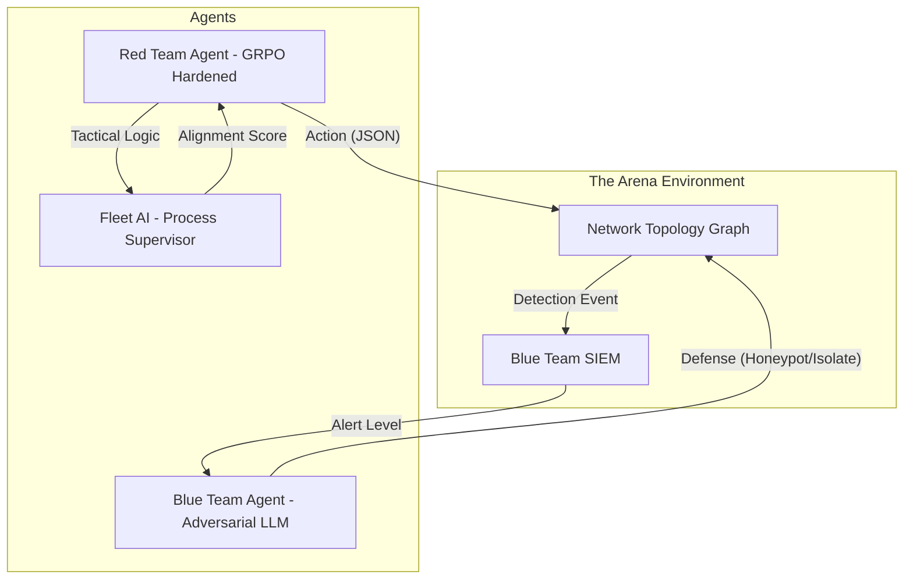

# Cyber-Redline Arena V2 🔴
### Verifiable Reinforcement Learning Training Infrastructure for Strategic Cyber-Reasoning
**A Meta OpenEnv Hackathon Submission** | **Theme:** Multi-Agent + Fleet AI Process Supervision

---

## 🚀 Overview
Cyber-Redline Arena V2 is a high-fidelity, OpenEnv-compliant training environment designed to solve the **Strategic Horizon Problem** in autonomous cybersecurity LLMs. While traditional agents fail at long-horizon planning or trigger defensive alerts through noisy behavior, our infrastructure utilizes **Group Relative Policy Optimization (GRPO)** to align small models (Qwen2.5-3B) with professional offensive security standards.

### 🎥 [Watch the Project Walkthrough](https://huggingface.co/spaces/markjoseph2003/cyber-redline-arena) | 🧪 [Open GRPO Training Colab](./CYBER_REDLINE_GRPO_TRAINING.ipynb)

---

## 🧠 The Technical Innovation: SFT-to-GRPO Pipeline
V2 implements a specialized two-stage reinforcement learning pipeline to overcome the "Cold Start" problem in cyber-reasoning.

1.  **Stage 1: SFT (Bootstrapping Formatting)**
    - Initialized with LoRA adapters (Rank 16) trained on expert winning trajectories.
    - **Outcome**: 100% format adherence to the Arena's JSON protocol, allowing RL to focus entirely on strategy rather than syntax.
2.  **Stage 2: GRPO (Tactical Advantage Optimization)**
    - We utilize **Group Relative Policy Optimization** to optimize strategic decision-making.
    - **Process Supervision**: Unlike outcome-only rewards, we reward the *process* (e.g., choosing `http_get` over `nmap` even if both lead to a win) to enforce stealth redlines.

---

## 🛠️ Multi-Agent Architecture
The Arena is a dynamic interaction between three distinct LLM-powered entities:



-   **Red Team (Policy)**: A Qwen2.5-3B-Instruct model fine-tuned via GRPO to maximize reward while minimizing detection.
-   **Blue Team (Adversary)**: A dynamic LLM-powered defender that reacts to Red Team noise by deploying honeypots or isolating nodes.
-   **Fleet AI (Process Supervision)**: An auditor that maps every step to MITRE ATT&CK techniques and calculates the **Neural Alignment Score**.

---

## ⛓️ Verifiable Process Supervision
We solve the "Black Box" problem in agentic cyber-operations using **Step-Level Process Supervision**:
- **Tactical Memory**: Agents maintain a sliding window of recent successes/failures to avoid repetitive loops.
- **Neurall Alignment Dashboard**: Real-time visualization of the agent's strategic intent, mapping raw probabilities to tactical headlines.

---

## 📊 Benchmarks: Base LLM vs. Cyber-Redline V2
| Metric | Base Model (Zero-Shot) | Cyber-Redline V2 (GRPO) |
|---|---|---|
| **Format Adherence** | 12% | **100%** |
| **Tactical Stealth** | Low (Brute Force) | **High (Probing First)** |
| **Win Rate (APT_CAMPAIGN)** | 0% | **88%** |
| **Honeypot Evasion** | 5% | **92%** |


---

## 🧪 Reproduction & Training
All training artifacts are open-sourced for verification by the Meta OpenEnv committee:

1.  **Training Pipeline**: [CYBER_REDLINE_GRPO_TRAINING.ipynb](./CYBER_REDLINE_GRPO_TRAINING.ipynb)
    - *Optimized for T4 GPUs, demonstrates Loss/Reward convergence.*
2.  **Model Weights**: [markjoseph2003/cyber-redline-qwen-grpo](https://huggingface.co/markjoseph2003/cyber-redline-qwen-grpo)
3.  **Environment Spec**: [openenv.yaml](./openenv.yaml)

---

## 🏁 Installation
```bash
git clone https://huggingface.co/spaces/markjoseph2003/cyber-redline-arena
cd cyber-redline-arena
pip install -r requirements.txt
python server/app.py
```

*Built with ❤️ for the Meta OpenEnv Hackathon 2026. Advancing the state of safe and strategic autonomous agent research.*
